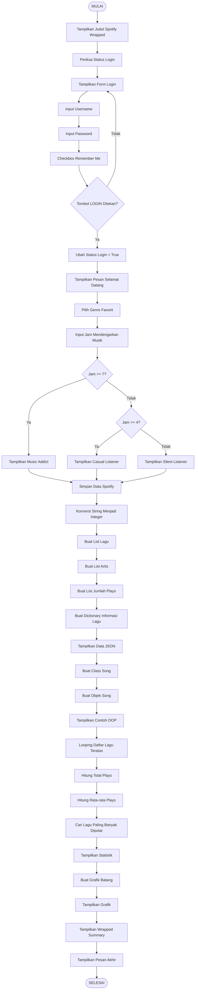

```mermaid
flowchart TD

A([MULAI]) --> B[Tampilkan Judul Spotify Wrapped]

B --> C[Periksa Status Login]

C --> D[Tampilkan Form Login]
D --> E[Input Username]
E --> F[Input Password]
F --> G[Checkbox Remember Me]

G --> H{Tombol LOGIN Ditekan?}

H -- Tidak --> D
H -- Ya --> I[Ubah Status Login = True]

I --> J[Tampilkan Pesan Selamat Datang]

J --> K[Pilih Genre Favorit]

K --> L[Input Jam Mendengarkan Musik]

L --> M{Jam >= 7?}

M -- Ya --> N[Tampilkan Music Addict]
M -- Tidak --> O{Jam >= 4?}

O -- Ya --> P[Tampilkan Casual Listener]
O -- Tidak --> Q[Tampilkan Silent Listener]

N --> R[Simpan Data Spotify]
P --> R
Q --> R

R --> S[Konversi String Menjadi Integer]

S --> T[Buat List Lagu]
T --> U[Buat List Artis]
U --> V[Buat List Jumlah Plays]

V --> W[Buat Dictionary Informasi Lagu]

W --> X[Tampilkan Data JSON]

X --> Y[Buat Class Song]

Y --> Z[Buat Objek Song]

Z --> AA[Tampilkan Contoh OOP]

AA --> AB[Looping Daftar Lagu Teratas]

AB --> AC[Hitung Total Plays]

AC --> AD[Hitung Rata-rata Plays]

AD --> AE[Cari Lagu Paling Banyak Diputar]

AE --> AF[Tampilkan Statistik]

AF --> AG[Buat Grafik Batang]

AG --> AH[Tampilkan Grafik]

AH --> AI[Tampilkan Wrapped Summary]

AI --> AJ[Tampilkan Pesan Akhir]

AJ --> AK([SELESAI])
```
